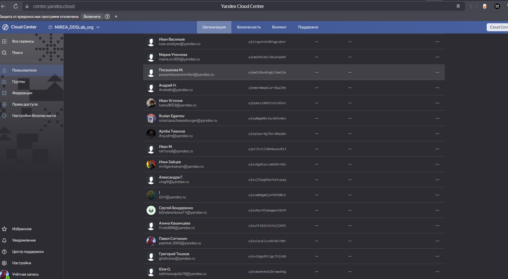
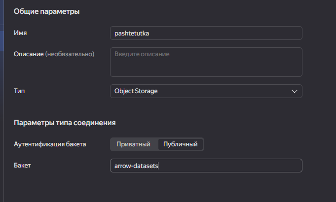
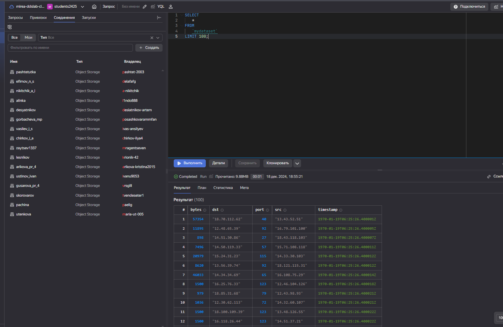
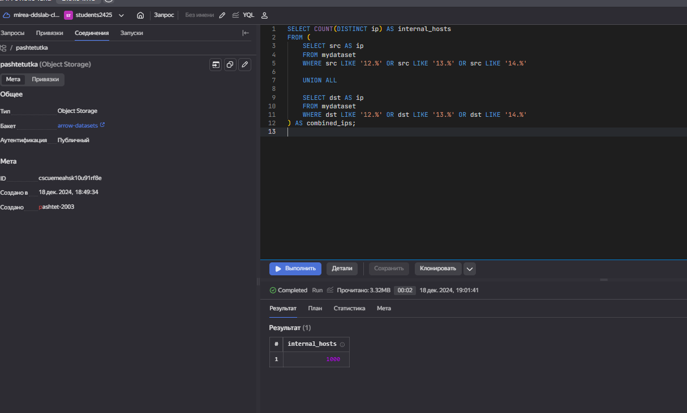
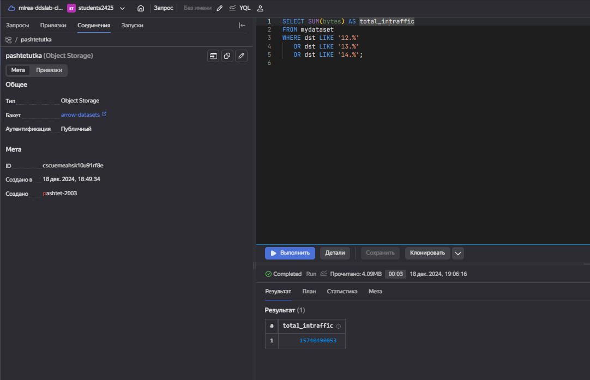

# Технология Yandex Query для анализа данных сетевой активности
pashtet.2003@yandex.ru

## Цель работы

1.  Изучить возможности технологии Yandex Query для анализа
    структурированных наборов данных
2.  Получить навыки построения аналитического пайплайна для анализа
    данных с помощью сервисов Yandex Cloud
3.  Закрепить практические навыки использования SQL для анализа данных
    сетевой активности в сегментированной корпоративной сети

## Исходные данные

1.  Программное обеспечение Windows 10
2.  Подсоединенный к Yandex Cloud Organization аккаунт
3.  Бакет arrow-datasets

## План

1.  Проверить доступность данных в бакете `arrow-datasets` с
    использованием URL или встроенных инструментов Yandex Query.
2.  Подключить бакет как источник данных в Yandex Query с использованием
    настроек подключения и методов аутентификации.
3.  Решить аналитические задачи, используя SQL-запросы для работы с
    данными сетевой активности.

## Ход выполнения работы

### 1. Присоединение к организации

Для начала работы необходимо выполнить подключение к организации Yandex
Cloud, в которой зарегистрирован аккаунт. В процессе подключения
производится аутентификация и проверка прав доступа.

-   Открываем интерфейс Yandex Query в веб-браузере.

-   Переходим в раздел “Организация” и выполняем присоединение к
    доступной Yandex Cloud Organization.

-   Проверяем успешное подключение через статус в интерфейсе.

    

### 2. Проверка доступности данных с помощью сконструированного URL

На этом этапе необходимо убедиться, что данные доступны для анализа. Для
этого:

-   Формируем URL к файлу данных в бакете `arrow-datasets`. Структура
    URL должна соответствовать требованиям Yandex Object Storage.

-   Вставляем URL в браузер и проверяем доступность файла. При успешном
    доступе будет предложено загрузить файл или просмотреть его
    метаданные.

    

Проверка URL позволяет убедиться, что бакет и файл `yaqry_dataset.pqt`
доступны для использования в дальнейшем анализе через Yandex Query.

### 3. Создание собственного соединения по своей фамилии

Для подключения к бакету необходимо создать собственное соединение с
данными.

-   В интерфейсе Yandex Query выбираем создание нового подключения.
-   Вводим название бакета `arrow-datasets` и выбираем тип
    аутентификации – публичный доступ.
-   Сохраняем настройки и проверяем успешность подключения.

После создания соединения настраиваем привязку данных:

-   Выбираем файл `yaqry_dataset.pqt` как источник данных для
    дальнейшего анализа.

-   Проверяем метаданные и структуру файла через интерфейс Yandex Query.

    

### 4. Проверка датасета аналитическим запросом

Перед началом выполнения заданий проверяем корректность подключения и
данных с помощью простого SQL-запроса:

``` sql
SELECT * 
FROM mydataset 
LIMIT 10;
```

-   Запрос возвращает первые 10 строк из подключенного набора данных.

-   Результаты позволяют убедиться, что данные загружены корректно и
    готовы для анализа.

    

## Анализ и выполнение заданий

### 1. Определите количество хостов внутренней сети

Известно, что IP-адреса внутренней сети начинаются с октетов,
принадлежащих интервалу `[12-14]`. Для определения количества хостов:

-   Выполняем фильтрацию IP-адресов в столбце `src` или `dst`, проверяя,
    что первый октет находится в диапазоне `12-14`.
-   Используем SQL-запрос с оператором `LIKE` для поиска по шаблону.

``` sql
SELECT COUNT(DISTINCT src) AS internal_hosts
FROM mydataset
WHERE src LIKE '12.%' OR src LIKE '13.%' OR src LIKE '14.%';
```

Этот запрос подсчитывает количество уникальных IP-адресов,
соответствующих внутренней сети.



### 2. Определите суммарный объем исходящего трафика

Исходящий трафик рассчитывается как сумма значений в колонке `bytes` для
всех исходящих соединений.

``` sql
SELECT SUM(bytes) AS total_outtraffic
FROM mydataset
WHERE src LIKE '12.%' OR src LIKE '13.%' OR src LIKE '14.%';
```

Запрос фильтрует данные по IP-адресам внутренней сети и суммирует объем
переданных данных для всех исходящих соединений.


### 3. Определите суммарный объем входящего трафика

Входящий трафик рассчитывается аналогично, но с использованием колонки
`dst`, представляющей получателей данных:

``` sql
SELECT SUM(bytes) AS total_intraffic
FROM mydataset
WHERE dst LIKE '12.%' OR dst LIKE '13.%' OR dst LIKE '14.%';
```

Этот запрос позволяет определить суммарный объем данных, полученных
хостами внутренней сети.



## Оценка результата

В процессе выполнения работы были изучены возможности технологии Yandex
Query для анализа данных из хранилища Yandex Object Storage. С
использованием SQL-запросов были выполнены следующие задачи:

1.  Подсчитано количество уникальных хостов внутренней сети.
2.  Определен суммарный объем исходящего трафика для хостов внутренней
    сети.
3.  Рассчитан суммарный объем входящего трафика для хостов внутренней
    сети.

Работа показала, что Yandex Query позволяет выполнять анализ данных в
удобной и эффективной форме, используя SQL-запросы для работы с большими
объемами структурированных данных.

## Вывод

Платформа Yandex Query является удобным, интерактивным и бессерверным
инструментом для анализа данных. Она позволяет обрабатывать данные из
различных хранилищ, таких как Yandex Object Storage, используя
SQL-запросы. В ходе работы был построен аналитический пайплайн,
включающий проверку доступности данных, подключение источника и
выполнение аналитических запросов. Полученные навыки позволят эффективно
решать задачи анализа сетевой активности и других структурированных
наборов данных.
